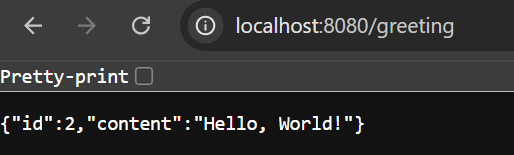

# **Practicas de implementación de un servicio Rest 🚀**

## Llamado al servicio sin parametros:

Cada vez que se realiza un llamado al servicio aumenta el id

## Llamado del servicio con parametros:

